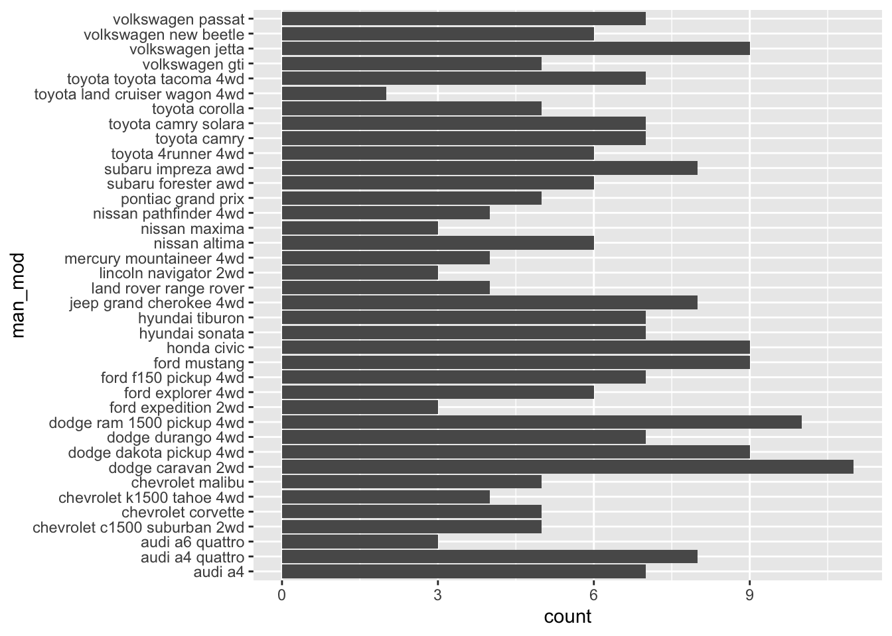
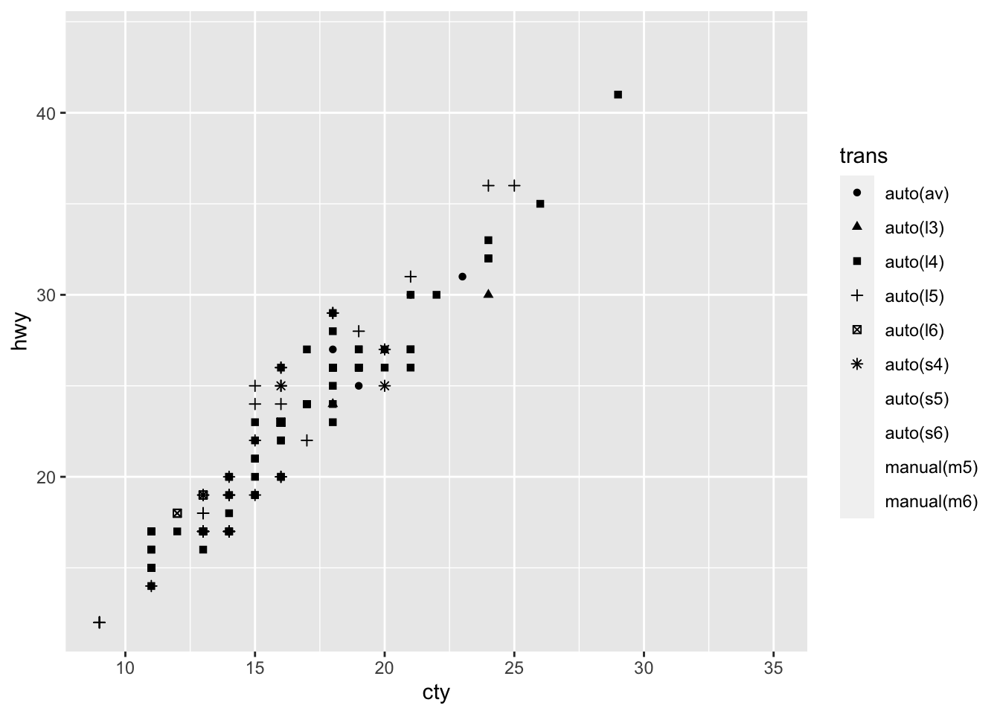
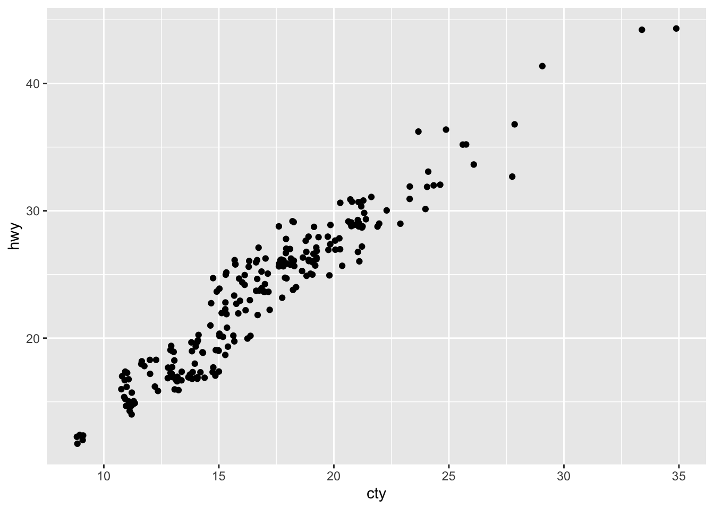
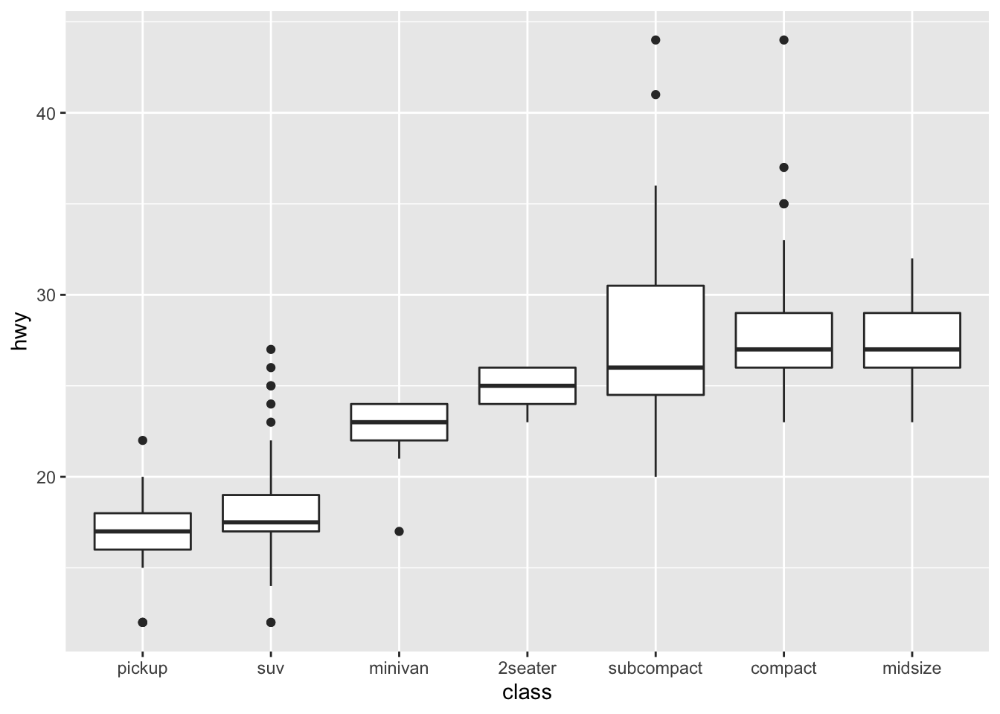

# (PART) Getting started {-} 


# First steps


## Exercises

There are none in this section.

## Exercises

**1.** List five functions that you could use to get more information about the `mpg` dataset.

-   `help(mpg)`: Documentation of dataset
-   `dim(mpg)`: Dimensions of dataset
-   `summary(mpg)`: Summary measures of dataset
-   `str(mpg)`: Display of the internal structure of dataset
-   `glimpse(mpg)`: `dplyr` version of `str(mpg)`

<br>

**2.**  How can you find out what other datasets are included with ggplot2?

-   `data(package = "ggplot2")` loads the available data sets in ggplot2. Alternatively,if you have internet access, go to https://ggplot2.tidyverse.org/reference/index.html#section-data

<br>

**3.**  Apart from the US, most countries use fuel consumption (fuel consumed over fixed distance) rather than fuel economy (distance travelled with fixed amount of fuel). How could you convert cty and hwy into the European standard of l/100km?

- According to [asknumbers](https://www.asknumbers.com/mpg-to-L100km.aspx), you divide 235.214583 by the mpg values in `cty` and `hwy` to convert them into the European standard of l/100km. 

- Function to convert into European standard (Rademaker, 2016):


```r
mpgTol100km <- function(milespergallon){
  
  GalloLiter <- 3.785411784
  MileKilometer <- 1.609344 
  
  l100km <- (100*GalloLiter)/(milespergallon*MileKilometer)
  l100km
  
}
```


<br>

**4.**  Which manufacturer has the most models in this dataset? Which model has the most variations? Does your answer change if you remove the redundant specification of drive train (e.g. "pathfinder 4wd", "a4 quattro") from the model name?


```r
# Count manufacturers and sort
mpg %>% count(manufacturer, sort = TRUE)
#> # A tibble: 15 × 2
#>    manufacturer     n
#>    <chr>        <int>
#>  1 dodge           37
#>  2 toyota          34
#>  3 volkswagen      27
#>  4 ford            25
#>  5 chevrolet       19
#>  6 audi            18
#>  7 hyundai         14
#>  8 subaru          14
#>  9 nissan          13
#> 10 honda            9
#> 11 jeep             8
#> 12 pontiac          5
#> 13 land rover       4
#> 14 mercury          4
#> 15 lincoln          3
```

- `dodge` has the most models in this dataset.


```r
unique(mpg$model)
#>  [1] "a4"                     "a4 quattro"            
#>  [3] "a6 quattro"             "c1500 suburban 2wd"    
#>  [5] "corvette"               "k1500 tahoe 4wd"       
#>  [7] "malibu"                 "caravan 2wd"           
#>  [9] "dakota pickup 4wd"      "durango 4wd"           
#> [11] "ram 1500 pickup 4wd"    "expedition 2wd"        
#> [13] "explorer 4wd"           "f150 pickup 4wd"       
#> [15] "mustang"                "civic"                 
#> [17] "sonata"                 "tiburon"               
#> [19] "grand cherokee 4wd"     "range rover"           
#> [21] "navigator 2wd"          "mountaineer 4wd"       
#> [23] "altima"                 "maxima"                
#> [25] "pathfinder 4wd"         "grand prix"            
#> [27] "forester awd"           "impreza awd"           
#> [29] "4runner 4wd"            "camry"                 
#> [31] "camry solara"           "corolla"               
#> [33] "land cruiser wagon 4wd" "toyota tacoma 4wd"     
#> [35] "gti"                    "jetta"                 
#> [37] "new beetle"             "passat"
```

- (Rademaker, 2016) The `a4` and `camry` both have a second model (the `a4 quattro` and the `camry solar`)


```r
# Remove redundant information (Rademaker, 2016)
str_trim(str_replace_all(unique(mpg$model), c("quattro" = "", "4wd" = "", 
                                     "2wd" = "", "awd" = "")))
#>  [1] "a4"                 "a4"                
#>  [3] "a6"                 "c1500 suburban"    
#>  [5] "corvette"           "k1500 tahoe"       
#>  [7] "malibu"             "caravan"           
#>  [9] "dakota pickup"      "durango"           
#> [11] "ram 1500 pickup"    "expedition"        
#> [13] "explorer"           "f150 pickup"       
#> [15] "mustang"            "civic"             
#> [17] "sonata"             "tiburon"           
#> [19] "grand cherokee"     "range rover"       
#> [21] "navigator"          "mountaineer"       
#> [23] "altima"             "maxima"            
#> [25] "pathfinder"         "grand prix"        
#> [27] "forester"           "impreza"           
#> [29] "4runner"            "camry"             
#> [31] "camry solara"       "corolla"           
#> [33] "land cruiser wagon" "toyota tacoma"     
#> [35] "gti"                "jetta"             
#> [37] "new beetle"         "passat"
```

<br>


## Exercises

**1.**  How would you describe the relationship between `cty` and `hwy`? Do you have any concerns about drawing conclusions from that plot?


```r
mpg %>% 
  ggplot(aes(cty, hwy)) +
  geom_point()
```


-   The plot shows a strongly linear relationship, which tells me that `cty` and `hwy` are highly correlated variables. The only concern I have is that the points seem to be overlapping.
- There is not much insight to be gained except that cars which are fuel efficient on a highway are also fuel efficient in cities. This relationship is probably a function of speed (Rademaker, 2016) 

<br>

**2.**  What does `ggplot(mpg, aes(model, manufacturer)) + geom_point()` show? Is it useful? How could you modify the data to make it more informative?


```r
ggplot(mpg, aes(model, manufacturer)) +
  geom_point()
```


-   The plot shows the manufacturer of each model. Its not very readable since there are too many models and this clutters up the x-axis with too many ticks! I would just plot 20 or so models so that the graph is more readable. See below:


```r
mpg %>% 
  head(25) %>% 
  ggplot(aes(model, manufacturer)) +
  geom_point()
```


- A possible alternative would be to look total number of observations for each manufacturer-model combination using geom_bar(). (Rademaker, 2016)


```r
df <- mpg %>% 
  transmute("man_mod" = paste(manufacturer, model, sep = " "))


ggplot(df, aes(man_mod)) +
  geom_bar() + 
  coord_flip()
```




<br>

**3.**  Describe the data, aesthetic mappings and layers used for each of the following plots. You'll need to guess a little because you haven't seen all the datasets and functions yet, but use your common sense! See if you can predict what the plot will look like before running the code.

1. `ggplot(mpg, aes(cty, hwy)) + geom_point()`

-   *Data*: `mpg`

-   *Aesthetic*: highway miles per gallon is mapped to y position and city miles per gallon is mapped to x position.

-   *Layer*: points

2. `ggplot(diamonds, aes(carat, price)) + geom_point()`

-   *Data*: `diamonds`

-   *Aesthetic*: price in US dollars is mapped to y position, weight of the diamond is mapped to x position.

-   *Layer*: points

3.  `ggplot(economics, aes(date, unemploy)) + geom_line()`

-   *Data*: `economics`

-   *Aesthetic*: median duration of unemployment, in weeks, is mapped to y position and month of data collection is mapped to x position.

-   *Layer*: line

(Rademaker, 2016) Alternatively, you can always access plot info using summary(<plot>) as in e.g.

```r
# summary(<plot>)
summary(ggplot(economics, aes(date, unemploy)) + geom_line())
#> data: date, pce, pop, psavert, uempmed, unemploy
#>   [574x6]
#> mapping:  x = ~date, y = ~unemploy
#> faceting: <ggproto object: Class FacetNull, Facet, gg>
#>     compute_layout: function
#>     draw_back: function
#>     draw_front: function
#>     draw_labels: function
#>     draw_panels: function
#>     finish_data: function
#>     init_scales: function
#>     map_data: function
#>     params: list
#>     setup_data: function
#>     setup_params: function
#>     shrink: TRUE
#>     train_scales: function
#>     vars: function
#>     super:  <ggproto object: Class FacetNull, Facet, gg>
#> -----------------------------------
#> geom_line: na.rm = FALSE, orientation = NA
#> stat_identity: na.rm = FALSE
#> position_identity
```

<br>

## Exercises

**1.**  Experiment with the colour, shape and size aesthetics. What happens when you map them to continuous values? What about categorical values? What happens when you use more than one aesthetic in a plot?


```r
# Map color to continuous value
mpg %>% 
  ggplot(aes(cty, hwy, color = displ)) +
  geom_point()
```


```r
# Map color to categorical value
mpg %>% 
  ggplot(aes(cty, hwy, color = trans)) +
  geom_point()
```


```r
# Use more than one aesthetic in a plot
mpg %>% 
  ggplot(aes(cty, hwy, color = trans, size = trans)) +
  geom_point()
#> Warning: Using size for a discrete variable is not advised.
```


<br>

**2.**  What happens if you map a continuous variable to shape? Why? What happens if you map trans to shape? Why?


```r
mpg %>% 
  ggplot(aes(cty, hwy, shape = displ)) +
  geom_point()
```

-   I can not map a continuous variable to shape and I get an error message: `Error: A continuous variable can not be mapped to shape`


```r
mpg %>% 
  ggplot(aes(cty, hwy, shape = trans)) +
  geom_point()
#> Warning: The shape palette can deal with a maximum of 6
#> discrete values because more than 6 becomes difficult
#> to discriminate; you have 10. Consider specifying
#> shapes manually if you must have them.
#> Warning: Removed 96 rows containing missing values
#> (geom_point).
```



-   I get an warning message that tells me the shape palette can only deal with 6 discrete values. 


<br>


**3.**  How is drive train related to fuel economy? How is drive train related to engine size and class?


```r
mpg %>% 
  group_by(drv) %>% 
  summarise(mean_cty = mean(cty)) %>% 
  ggplot(aes(drv, mean_cty)) +
  geom_col()
```


```r

mpg %>% 
  group_by(drv) %>% 
  summarise(mean_hwy = mean(hwy)) %>% 
  ggplot(aes(drv, mean_hwy)) +
  geom_col()
```


-   Front-wheel drive has the best fuel economy, then 4wd, then rear wheel drive.


```r
mpg %>% 
  ggplot(aes(drv, displ, fill = class)) +
  geom_col(position = "dodge")
```


-   4wd has biggest engine size, then front-wheel, then rear wheel drive. Out of all 4wd, suvs have biggest engine size. Out of all front-wheel drive, midsize has biggest engine size. Out of all rear wheel drive, 2 seater has biggest engine size.

<br>


## Exercises

**1.**  What happens if you try to facet by a continuous variable like hwy? What about cyl? What's the key difference?


```r
mpg %>% 
  ggplot(aes(drv, displ, fill = class)) +
  geom_col(position = "dodge") +
  facet_wrap(~hwy)
```


```r
mpg %>% 
  ggplot(aes(drv, displ, fill = class)) +
  geom_col(position = "dodge") +
  facet_wrap(~cyl)
```


-   The key difference is `hwy` is a continuous variable that has 27 unique values, so you get 27 different subsets. However, `cly` is a categorical variable and has 4 unique values, so `cyl` only has 4 different subsets. It is less cluttered when you try to facet.
- (Rademaker, 2016) Facetting by a continous variable works but becomes hard to read and interpret when the variable that we facet by has to many levels. 

<br>

**2.**  Use faceting to explore the 3-way relationship between fuel economy, engine size, and number of cylinders. How does faceting by number of cylinders change your assessement of the relationship between engine size and fuel economy?


```r
mpg %>% 
  ggplot(aes(displ, cty)) +
  geom_point()
```


```r
mpg %>% 
  ggplot(aes(displ, cty)) +
  geom_point() +
  facet_wrap(~cyl)
```


-   When I initially plot engine size and fuel economy, I see an overall decreasing linear relationship. Upon faceting, I see that the decreasing relationship is mostly seen in the 4 cylinder subset. In the other cylinder subsets, we see a flat relationship - as engine displacement increases, fuel economy remains constant.

<br>

**3.**  Read the documentation for `facet_wrap()`. What arguments can you use to control how many rows and columns appear in the output?

-   I can use the arguments `nrow, ncol` to control how many rows and columns appear in the output.


<br>

**4.**  What does the `scales` argument to `facet_wrap()` do? When might you use it?

-   It allows users to decide whether scales should be fixed. I would use it whenever different subsets of the data are on vastly different scales. 
- (Rademaker, 2016) If we want to compare across facets, `scales = "fixed"` is more appropriate. If our focus is on individual patterns within each facet, setting `scales = "free"` might be more approriate.


<br>


## Exercises

**1.**  What's the problem with the plot created by `ggplot(mpg, aes(cty, hwy)) + geom_point()`? Which of the geoms described above is most effective at remedying the problem?


```r
ggplot(mpg, aes(cty, hwy)) + 
  geom_point()
```


- The problem is overplotting. 

Solution 1. Use `geom_jitter` to add random noise to the data and avoid overplotting.


```r
ggplot(mpg, aes(cty, hwy)) + 
  geom_jitter()
```



Solution 2. (Rademaker, 2016) Set opacity with `alpha`


```r
ggplot(mpg, aes(cty, hwy)) +
  geom_point(alpha = 0.3)
```


<br>

**2.**  One challenge with `ggplot(mpg, aes(class, hwy)) + geom_boxplot()` is that the ordering of `class` is alphabetical, which is not terribly useful. How could you change the factor levels to be more informative?


```r
mpg %>% 
  mutate(class = factor(class),
         class = fct_reorder(class, hwy)) %>% 
  ggplot(aes(class, hwy)) +
  geom_boxplot()
```



- We could convert `class` to a factor and reorder it by `hwy`

<br>

**3.**  Explore the distribution of the carat variable in the `diamonds` dataset. What binwidth reveals the most interesting patterns?


```r
diamonds %>% 
  ggplot(aes(carat)) +
  geom_histogram(binwidth = 0.3)
```


-   This is a subjective answer, but binwidth of 0.2 or 0.3 reveals that the distribution of `carat` is heavily skewed to the right. This means that most diamonds carats are between 0 and 1.

<br>

**4.**  Explore the distribution of the price variable in the `diamonds` data. How does the distribution vary by cut?


```r
diamonds %>% 
  ggplot(aes(price)) +
  geom_histogram()
#> `stat_bin()` using `bins = 30`. Pick better value with
#> `binwidth`.
```


```r

diamonds %>% 
  mutate(cut = fct_reorder(cut, price)) %>% 
  ggplot(aes(cut, price)) +
  geom_boxplot()
```


```r

ggplot(diamonds, aes(x = price, y =..density.., color = cut)) +
  geom_freqpoly(binwidth = 200)
```


-  (Rademaker, 2016) Fair quality diamonds are more expensive then others. Possible reason is they are bigger.


<br>

**5.**  You now know (at least) three ways to compare the distributions of subgroups: `geom_violin()`, `geom_freqpoly()` and the colour aesthetic, or `geom_histogram()` and faceting. What are the strengths and weaknesses of each approach? What other approaches could you try?

- According to the book, `geom_violin()` shows a compact representation of the "density" of the distribution, highlighting the areas where more points are found. Its weakness is that violin plos rely on the calculation of a density estimate, which is hard to interpret.

- According to the book, `geom_freqploy()` bins the data, then counts the number of observations in each bin using lines. One possible weakness is that you have to select the width of the bins yourself by experimentation.

- According to the book, `geom_histogram()` and faceting makes it easier to see the distribution of each group, but makes comparisons between groups a little harder.


<br>


**6.**  Read the documentation for `geom_bar()`. What does the `weight` aesthetic do?


```r
?geom_bar()
```

-   The `weight` aesthetic converts the number of cases to a weight and makes the height of the bar proportional to the sum of the weights. See below:


```r
g <- ggplot(mpg, aes(class))

# Number of cars in each class:
g + geom_bar()
```


```r
# Total engine displacement of each class
g + geom_bar(aes(weight = displ))
```


<br>


**7.**  Using the techniques already discussed in this chapter, come up with three ways to visualize a 2d categorical distribution. Try them out by visualising the distribution of `model` and `manufacturer`, `trans` and `class`, and `cyl` and `trans`.

- Not sure
