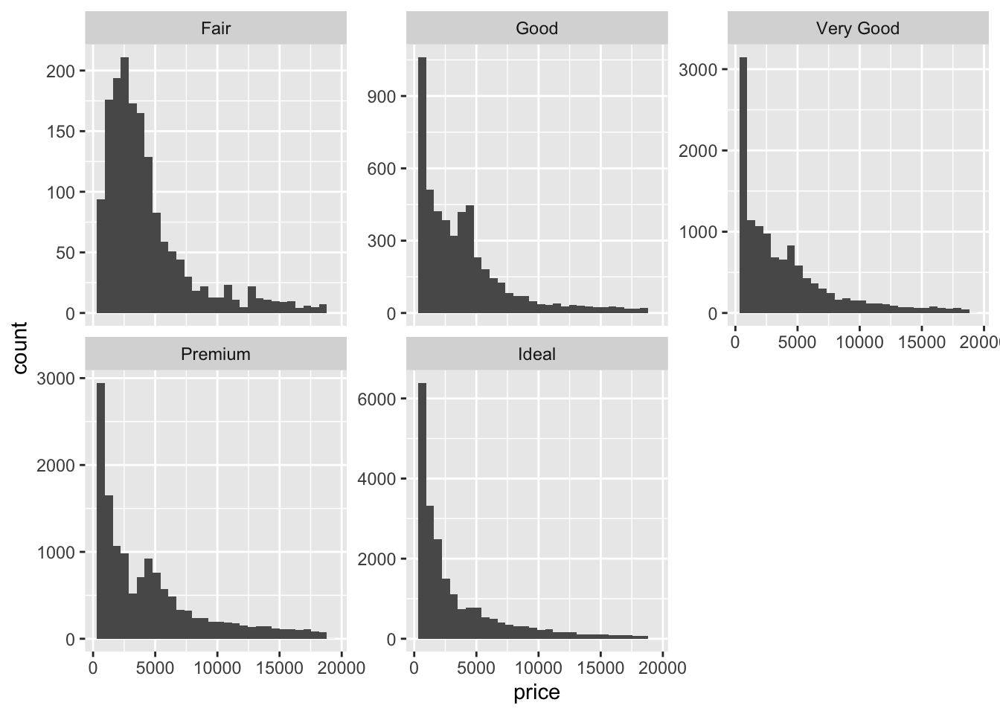
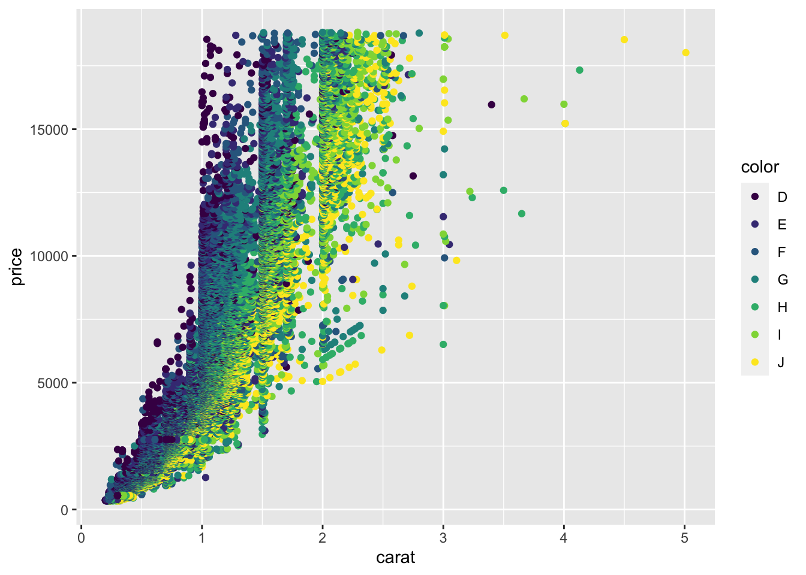
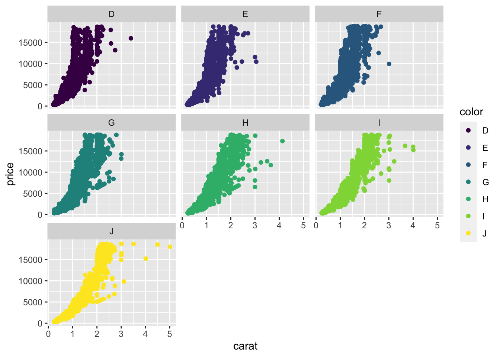

# Faceting


## Exercises

**1.**

```r
# faceting by cut and grouping by carat.
diamonds %>% 
  ggplot(aes(price)) +
  geom_histogram(aes(color = carat)) +
  facet_wrap(~cut, scales = "free_y")
#> `stat_bin()` using `bins = 30`. Pick better value with
#> `binwidth`.
```



```r

# faceting by carat and grouping by cut.
diamonds %>% 
  ggplot(aes(price)) +
  geom_histogram(aes(color = cut)) +
  facet_wrap(~carat, scales = "free_y")
#> `stat_bin()` using `bins = 30`. Pick better value with
#> `binwidth`.
```


- It makes more sense to facet by cut because its a discrete variable. Faceting by carat, a continuous variable, makes too many facets and renders the plot unreadable!


<br>

**2.**

```r
diamonds %>% 
  ggplot(aes(carat, price)) +
  geom_point(aes(color = color))
```




```r
diamonds %>% 
  ggplot(aes(carat, price)) +
  geom_point(aes(color = color)) +
  facet_wrap(~color)
```



- I think its better to use grouping to compare the different colors. The panels all have the same shape, so it's hard to compare the groups across facets. If I use faceting, I'd add that the plot is facetted by diamond colour, from D (best) to J (worst).

<br>

**3.** I think `facet_wrap()` is more useful than `facet_grid()` because the former function is useful if you have a single variable with many levels and want to arrange the plots in a more space efficient manner. In data analysis, its extremely common to have a single variable with many levels that the analyst wants to arrange the for easy comparison. Although `facet_grid()` works on single variables, `facet_wrap()` involves less typing when you have a single variable. 


<br>

**4.** 

```r
mpg2 <- subset(mpg, cyl != 5 & drv %in% c("4", "f") & class != "2seater")

mpg2 %>% 
  ggplot(aes(displ, hwy)) +
  geom_point() +
  geom_smooth(data = mpg2 %>% select(-class), 
              se = FALSE,
              method = "loess") +
  
  facet_wrap(~class)
#> `geom_smooth()` using formula 'y ~ x'
```


