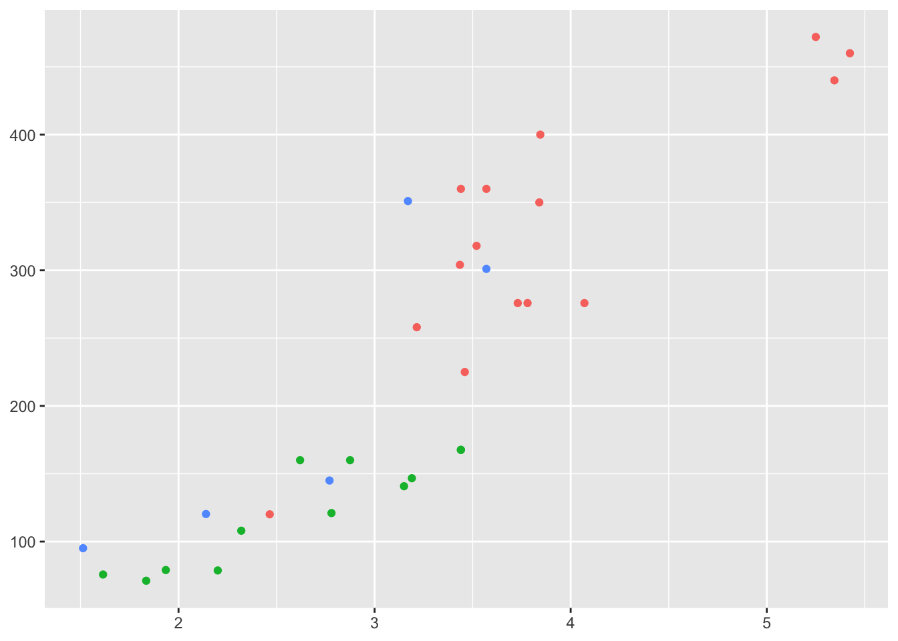

# (PART) Extending ggplot2 {-} 


# Programming with ggplot2


## Exercises

**1.**

```r
pink_hist <- geom_histogram(
  color = "pink",
  bins = 100
)
```


<br>


**2.** 

```r
fill_blues <- scale_fill_distiller(
  palette = "Blues"
)
```

<br>


**3.**

```r
?theme_gray()
```

- Its arguments include `base_size`, `base_family`, `base_line_size`, and `base_rect_size`
- According to the help file, `theme_gray()` is the signature ggplot2 theme with a grey background and white gridlines and is designed to put the data forward yet make comparisons easy.

<br>

**4.**

```r
scale_colour_wesanderson <- function(palette = "BottleRocket1", ...) {
  scale_color_manual(values = wesanderson::wes_palette(palette), ...) 
}

# Working example
ggplot(mtcars, aes(wt, disp, color = factor(gear))) +
  geom_point() +
  scale_colour_wesanderson()
```


<br>


## Exercises

**1.** 

```r
remove_labels <- theme(legend.position = "none",
                       axis.title.x = element_blank(),
                       axis.title.y = element_blank())

# Working Example
ggplot(mtcars, aes(wt, disp, color = factor(gear))) +
  geom_point() +
  remove_labels
```



<br>

**2.** Not sure 

<br>

## Exercises

These questions are way above my head!

## Exercises

These questions are way above my head!
